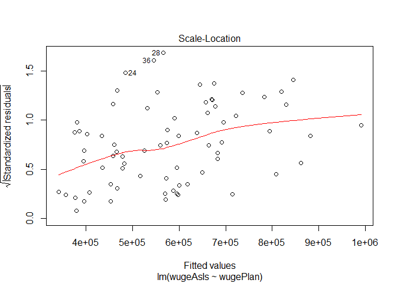

# Chulwalhar Export Forecast -Unit10CaseStudy
Paola Leon, Eyal Greenberg and Kyle Killion  
July 11, 2016  

###Set Working Directory and load fpp library

```r
setwd("C:/Users/hb13316/Documents/Data Science/Intro to Data Science/Case Study 2")
getwd()
```

```
## [1] "C:/Users/hb13316/Documents/Data Science/Intro to Data Science/Case Study 2"
```

```r
list.files()
```

```
## [1] "Case Study 10"                   "ChulwalarCode"                  
## [3] "ImportedAsIsDataChulwalar.csv"   "ImportedIndicatorsChulwalar.csv"
## [5] "ImportedPlanDataChulwalar.csv"
```

```r
library(fpp)
```

```
## Warning: package 'fpp' was built under R version 3.3.1
```

```
## Loading required package: forecast
```

```
## Warning: package 'forecast' was built under R version 3.3.1
```

```
## Loading required package: zoo
```

```
## 
## Attaching package: 'zoo'
```

```
## The following objects are masked from 'package:base':
## 
##     as.Date, as.Date.numeric
```

```
## Loading required package: timeDate
```

```
## This is forecast 7.1
```

```
## Loading required package: fma
```

```
## Warning: package 'fma' was built under R version 3.3.1
```

```
## Loading required package: tseries
```

```
## Warning: package 'tseries' was built under R version 3.3.1
```

```
## Loading required package: expsmooth
```

```
## Warning: package 'expsmooth' was built under R version 3.3.1
```

```
## Loading required package: lmtest
```

```
## Warning: package 'lmtest' was built under R version 3.3.1
```
<br><br>

###Read in raw data sets of Chulwalar and set to alternative variables

```r
rawAsIs <- read.csv("ImportedAsIsDataChulwalar.csv", sep = ";", 
                                         header=FALSE, fill=TRUE)
rawPlanned <- read.csv("ImportedPlanDataChulwalar.csv", sep = ";", 
                                         header=FALSE, fill=TRUE)
rawIndicator <- read.csv("ImportedIndicatorsChulwalar.csv", sep = ";", 
                                           header=FALSE, fill=TRUE)

cleanAsIs <- rawAsIs
cleanPlan <- rawPlanned
cleanIndicator <- rawIndicator
```


###Set Data to the Wuge Flower for interpretation breakdown


```r
wuge <- c(cleanAsIs [30:41,2],cleanAsIs [30:41,3],cleanAsIs [30:41,4],cleanAsIs [30:41,5],cleanAsIs [30:41,6],cleanAsIs [30:41,7])

wugeAsIs <- ts(wuge, start=c(2008,1), end=c(2013,12), frequency=12)

wuge2 <- c(cleanPlan [30:41,2],cleanPlan [30:41,3],cleanPlan [30:41,4],cleanPlan [30:41,5],cleanPlan [30:41,6],cleanPlan [30:41,7])

wugePlan <- ts(wuge2, start=c(2008,1), end=c(2013,12), frequency=12)

wugeIndicator <- ts(cleanIndicator[2:length(cleanIndicator),], start=c(2008,1), end=c(2013,12), frequency=12)
colnames(wugeIndicator) <- c('days','2008','2009','2010','2011','2012','2013','2014')
wugeIndicator <- wugeIndicator[, 1:7]
```


###Decompose for Wuge

```r
decIndicator <- decompose(wugeIndicator)
decPlan <- decompose(wugePlan)
decAsIs <- decompose(wugeAsIs)

plot(decPlan)
```

<!-- -->

```r
plot(decAsIs)
```

<!-- -->

###Seasonal Decomposition for Wuge

```r
wuge_stl <- stl(wugeAsIs , s.window=5)

#Plot the STL
plot(wuge_stl$time.series/1000,
     main='Wuge STL Analysis (based units per 1000)')
```

<!-- -->


####Plot the Trend by itself 

```r
plot(wuge_stl$time.series[,'trend']/1000)
```

<!-- -->


####Loop through the STL for a AsIs resample of monthly TimeFrames

```r
comp <- c('seasonal','trend','remainder')
for ( i in comp){
  monthplot(wuge_stl$time.series[,i],
            ylab = 'i',
            main=paste('AsIs',i))
}
```

<!-- --><!-- --><!-- -->


```r
wugePlan_stl <- stl(wugePlan , s.window=5)
#Plot the STL
plot(wugePlan_stl$time.series/1000,
     main='Wuge STL Analysis (based units per 1000)')
```

<!-- -->

```r
#Plot the Trend by itself 
plot(wugePlan_stl$time.series[,'trend']/1000)
```

<!-- -->

```r
#Loop through the STL for a Planned resample of monthly TimeFrames
comp <- c('seasonal','trend','remainder')
for ( i in comp){
  monthplot(wugePlan_stl$time.series[,i],
            ylab = 'i',
            main=paste('Planned',i))
}
```

<!-- --><!-- --><!-- -->


####Correlation with Wuge AsIs and Plan


```r
cor(wugeAsIs , wugePlan)
```

```
## [1] 0.8788474
```


#Holts Winters for Wuge
<br><br>

###Shorten the Time Series in order to compare Accuracy between Acutal vs Forecast

```r
WugeAsIs_2012 <- ts(wugeAsIs, start=c(2008,1), end=c(2012,12), frequency=12)
wugeAsIs_shift4 <- ts(wuge, start=c(2008,1), end=c(2013,8), frequency = 12)
```


###Fit for 4 months out, Holt Winters Addivitive vs Multiplicative

```r
fit1 <- hw(wugeAsIs, h=4, seasonal = 'multiplicative')
fit1$model
```

```
## Holt-Winters' multiplicative method 
## 
## Call:
##  hw(x = wugeAsIs, h = 4, seasonal = "multiplicative") 
## 
##   Smoothing parameters:
##     alpha = 0.0243 
##     beta  = 0.0011 
##     gamma = 1e-04 
## 
##   Initial states:
##     l = 375726.9238 
##     b = 6201.6081 
##     s=1.1508 1.1548 1.1234 1.2784 0.9142 0.7926
##            0.8365 0.8951 0.888 1.0388 0.9634 0.9641
## 
##   sigma:  0.0967
## 
##      AIC     AICc      BIC 
## 1910.516 1920.407 1946.942
```

```r
mean(fit1$residuals)
```

```
## [1] -0.01219278
```

```r
sd(fit1$residuals)
```

```
## [1] 0.09656513
```


```r
fit2 <- hw(wugeAsIs, h=4, seasonal = 'additive')
fit2$model
```

```
## Holt-Winters' additive method 
## 
## Call:
##  hw(x = wugeAsIs, h = 4, seasonal = "additive") 
## 
##   Smoothing parameters:
##     alpha = 1e-04 
##     beta  = 1e-04 
##     gamma = 1e-04 
## 
##   Initial states:
##     l = 384577.2564 
##     b = 5345.5295 
##     s=90434.96 90939.89 62685.76 176495.2 -56313.34 -124136.2
##            -98857.06 -57078.56 -69804.56 25351.75 -18290.68 -21427.11
## 
##   sigma:  54690.67
## 
##      AIC     AICc      BIC 
## 1910.881 1920.771 1947.307
```

```r
mean(fit2$residuals)
```

```
## [1] -63.33698
```

```r
sd(fit2$residuals)
```

```
## [1] 55074.43
```

###Plot Fits of WugeAsIs

```r
plot(fit2, col='blue')
lines(fit1$fitted, col='red')
lines(fit1$mean, col='red')
```

<!-- -->


###Plot Fits of WugePlan against the WugeAsIs multiplicatives

```r
fit3 <- hw(wugePlan, h=4, seasonal = 'multiplicative')
plot(fit1, col='red')
lines(fit3$fitted, col='blue')
lines(fit3$mean, col='blue')
```

<!-- -->

*AIC AICc BIC are all lower with the additive and not mulitplicative*

<br><br>

###Check for the accuracy of the fit Holt Winters Additive vs Multiplicative

```r
fit1 <- hw(wugeAsIs_shift4, hw=4, seasonal = 'additive')
fit2 <- hw(wugeAsIs_shift4, hw=4, seasonal = 'multiplicative')
accuracy(fit1, wugeAsIs)
```

```
##                     ME     RMSE      MAE       MPE     MAPE      MASE
## Training set -6662.468 55040.84 44676.77 -2.410103 8.524185 0.5646370
## Test set     53298.066 71907.31 58727.54  5.705365 6.293236 0.7422144
##                    ACF1 Theil's U
## Training set -0.2664682        NA
## Test set     -0.6664192  1.802843
```

```r
accuracy(fit2, wugeAsIs)
```

```
##                     ME     RMSE      MAE       MPE     MAPE      MASE
## Training set -5883.245 54217.02 44165.23 -2.502564 8.473596 0.5581720
## Test set     17283.836 67032.75 59879.31  1.785706 6.420418 0.7567708
##                    ACF1 Theil's U
## Training set -0.2833591        NA
## Test set     -0.5955003  1.396312
```

<br><br>

###Compare the Holts vs the Exponential Smoothing Model
<br><br>

###Build the two Plan and AsIs Exp Smoothing Models

```r
wugePlan_ses <- ses(wugePlan)
wugeAsIs_ses <- ses(wugeAsIs)
```

###Plot the comparisons

```r
par(mfrow=c(2,1))
plot(wugePlan_ses$fitted - fit1$fitted, col='blue',
     main='Wuge Diff in Planned Exponential Smoothing vs Acutal Holts Fit')
lines(wugePlan_ses$mean - fit1$mean, col='red')
plot(wugePlan_ses$residuals, col='magenta', main='Residuals of Exponential Smoothing Planned vs Acutal')
lines(wugeAsIs_ses$residuals, col='green')
```

<!-- -->


###Output the values of the model

```r
wugeAsIs_ses$model
```

```
## Simple exponential smoothing 
## 
## Call:
##  ses(x = wugeAsIs) 
## 
##   Smoothing parameters:
##     alpha = 0.4971 
## 
##   Initial states:
##     l = 394763.3979 
## 
##   sigma:  108380.5
## 
##      AIC     AICc      BIC 
## 1981.370 1981.544 1985.923
```

```r
wugePlan_ses$model
```

```
## Simple exponential smoothing 
## 
## Call:
##  ses(x = wugePlan) 
## 
##   Smoothing parameters:
##     alpha = 0.6751 
## 
##   Initial states:
##     l = 416486.1345 
## 
##   sigma:  93984.29
## 
##      AIC     AICc      BIC 
## 1960.847 1961.021 1965.400
```


#Linear Fit for Wuge
<br><br>

###Here we bring in the National Holiday Indicator to fit for culture impact

```r
NationalHolidaysVector <- c(cleanIndicator[170:181,2],cleanIndicator[170:181,3],cleanIndicator[170:181,4],cleanIndicator[170:181,5],cleanIndicator[170:181,6],cleanIndicator[170:181,7])
NationalHolidays <- ts(NationalHolidaysVector, start=c(2008,1), end=c(2013,12), frequency=12)
```


###Slice out the Seaonal Decompositions for Wuge AsIs and Planned to use for the Regression

```r
trend <- wuge_stl$time.series[,'trend']
season <- wuge_stl$time.series[,'seasonal']
random <- wuge_stl$time.series[,'remainder']

trend2 <- wugePlan_stl$time.series[,'trend']
season2 <- wugePlan_stl$time.series[,'seasonal']
random2 <- wugePlan_stl$time.series[,'remainder']
```


###Look at some residuals EDA comparisons

```r
plot(lm(wugeAsIs ~ wugePlan))
```

<!-- --><!-- --><!-- --><!-- -->

```r
plot(lm(wugeAsIs ~ trend + season))
```

<!-- --><!-- --><!-- --><!-- -->

```r
plot(lm(wugeAsIs ~ trend2 + season2))
```

<!-- --><!-- --><!-- --><!-- -->


###Linear Fit of Wuge - Actual vs Planned with National Holidays factored in

```r
linFit_ActPlan1 <- tslm(wugeAsIs ~ wugePlan + season + trend + NationalHolidays)
linFit_ActPlan2 <- tslm(wugeAsIs ~ wugePlan + season2 + trend2 + NationalHolidays)
summary(linFit_ActPlan1)
```

```
## 
## Call:
## tslm(formula = wugeAsIs ~ wugePlan + season + trend + NationalHolidays)
## 
## Residuals:
##     Min      1Q  Median      3Q     Max 
## -109641  -32937     997   37327   96710 
## 
## Coefficients:
##                    Estimate Std. Error t value Pr(>|t|)    
## (Intercept)       4.019e+05  5.983e+04   6.718 9.39e-09 ***
## wugePlan         -1.317e-01  1.373e-01  -0.959 0.341425    
## season2          -2.064e+04  3.343e+04  -0.617 0.539419    
## season3           5.700e+04  3.479e+04   1.638 0.106834    
## season4          -1.786e+04  4.165e+04  -0.429 0.669701    
## season5          -6.940e+04  3.632e+04  -1.911 0.061074 .  
## season6          -1.038e+05  3.702e+04  -2.805 0.006879 ** 
## season7          -1.383e+05  3.956e+04  -3.496 0.000922 ***
## season8          -5.591e+04  3.425e+04  -1.633 0.108059    
## season9           1.981e+05  3.782e+04   5.237 2.46e-06 ***
## season10          8.626e+04  3.321e+04   2.597 0.011933 *  
## season11          1.052e+05  3.332e+04   3.157 0.002549 ** 
## season12          1.762e+05  4.791e+04   3.678 0.000522 ***
## trend             6.750e+03  8.828e+02   7.647 2.66e-10 ***
## NationalHolidays -6.774e+04  3.477e+04  -1.948 0.056310 .  
## ---
## Signif. codes:  0 '***' 0.001 '**' 0.01 '*' 0.05 '.' 0.1 ' ' 1
## 
## Residual standard error: 56760 on 57 degrees of freedom
## Multiple R-squared:  0.9072,	Adjusted R-squared:  0.8844 
## F-statistic: 39.81 on 14 and 57 DF,  p-value: < 2.2e-16
```

```r
summary(linFit_ActPlan2)
```

```
## 
## Call:
## tslm(formula = wugeAsIs ~ wugePlan + season2 + trend2 + NationalHolidays)
## 
## Residuals:
##     Min      1Q  Median      3Q     Max 
## -152103  -47903   -6658   38873  186891 
## 
## Coefficients:
##                    Estimate Std. Error t value Pr(>|t|)    
## (Intercept)      -1.343e+04  3.832e+04  -0.350   0.7271    
## wugePlan         -5.148e-01  2.578e-01  -1.997   0.0499 *  
## season2           1.518e+00  2.887e-01   5.259 1.63e-06 ***
## trend2            1.533e+00  2.696e-01   5.685 3.10e-07 ***
## NationalHolidays  6.889e+03  2.131e+04   0.323   0.7475    
## ---
## Signif. codes:  0 '***' 0.001 '**' 0.01 '*' 0.05 '.' 0.1 ' ' 1
## 
## Residual standard error: 67220 on 67 degrees of freedom
## Multiple R-squared:  0.847,	Adjusted R-squared:  0.8379 
## F-statistic: 92.74 on 4 and 67 DF,  p-value: < 2.2e-16
```

